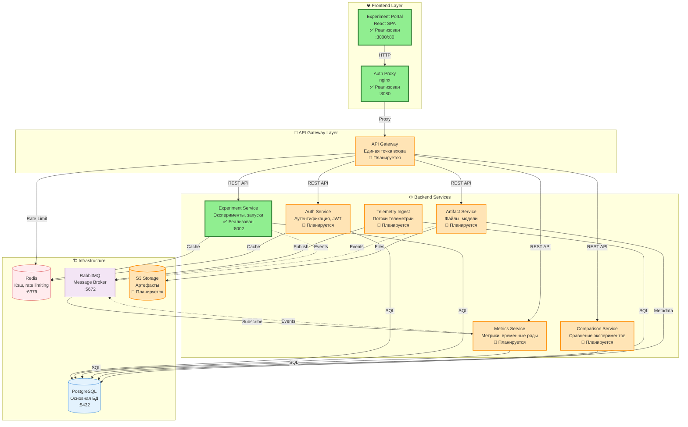

# Курс: Продуктовая разработка бэкенда

**ФАЛТ МФТИ | 2-3 курс**

## О курсе

Двухсеместровый практический курс по разработке современных бэкенд-систем с использованием Python, TypeScript и микросервисной архитектуры.

### Формат
- **Длительность:** 2 семестра (32 недели)
- **Нагрузка:** 1 пара (2 часа) в неделю
- **Формат:** Лекция + практика

### Технологический стек
- **Backend:** Python (aiohttp)
- **Frontend (для интеграции):** TypeScript, React
- **Базы данных:** PostgreSQL, Redis
- **Message Brokers:** RabbitMQ
- **Инфраструктура:** Docker, Docker Compose
- **CI/CD:** GitHub Actions
- **Тестирование:** pytest, testsuite (Yandex)
- **Мониторинг:** Prometheus, Grafana (базово)

## Структура курса

### Семестр 1: Основы бэкенд-разработки (14 учебных недель + 2 резерва)
1. **Модуль 1:** Веб-разработка и API (недели 1-4)
2. **Модуль 2:** Качество и тестирование (недели 5-7)
3. **Модуль 3:** Кэширование и производительность (недели 8-11)
4. **Модуль 4:** API контракты и интеграция с фронтендом (недели 12-14)
5. **Резервные недели:** 15-16 (каникулы, форс-мажоры, догоняющие занятия)

### Семестр 2: Микросервисы и продуктовая разработка (14 учебных недель + 2 резерва)
5. **Модуль 5:** Docker и деплой (недели 1-3)
6. **Модуль 6:** Микросервисная архитектура (недели 4-8)
7. **Модуль 7:** Продвинутые темы (недели 9-11)
8. **Модуль 8:** Финальный проект (недели 12-14)
9. **Резервные недели:** 15-16 (каникулы, форс-мажоры, защиты проектов)

## Навигация по репозиторию

```
product_dev_course/
├── course-materials/           # Материалы курса
│   ├── semester-1/
│   └── semester-2/
├── projects/
│   ├── backend/
│   │   ├── common/             # Общие компоненты и DTO
│   │   ├── libs/               # Внутренние библиотеки/SDK
│   │   └── services/           # Микросервисы платформы
│   │       └── experiment-service/
│   ├── frontend/
│   │   ├── common/             # Общие UI-компоненты и токены
│   │   ├── libs/               # Фронтенд библиотеки
│   │   └── apps/               # SPA/виджеты
│   │       └── experiment-portal/
│   ├── telemetry_cli/          # CLI для отправки телеметрии в Experiment Service
│   └── rc_vehicle/             # Документация и материалы по RC-модели
├── docs/                       # Документация
├── examples/                   # Примеры кода с занятий
└── README.md
```

## Быстрый старт

### Предварительные требования
- Python 3.14+
- Node.js 24 LTS+
- Docker Desktop
- Git
- Любой редактор кода (VS Code рекомендуется)

### Установка окружения
```bash
# Клонирование репозитория
git clone <repository-url>
cd product_dev_course

# Настройка Python окружения
cd course-materials/semester-1/module-1-web-api/week-01
python -m venv venv
source venv/bin/activate  # Linux/Mac
# или
venv\Scripts\activate  # Windows

# Установка зависимостей
pip install -r requirements.txt
```

Подробная инструкция: [Setup Guide](docs/setup-guide.md)

## Локальный запуск через Docker

Для быстрого запуска всей системы локально используется Docker Compose.

### Быстрый старт с Docker

```bash
# 1. Подготовка окружения
cp env.docker.example .env
cp docker-compose.override.yml.example docker-compose.override.yml

# 2. Запуск в development режиме (с hot-reload)
docker-compose up

# 3. Или в фоновом режиме
docker-compose up -d

# 4. Просмотр логов
docker-compose logs -f

# 5. Остановка
docker-compose down
```

### Доступные сервисы

После запуска доступны:
- **Experiment Portal (Frontend):** http://localhost:3000 (dev режим с hot-reload)
- **Experiment Service API:** http://localhost:8002
- **Auth Proxy (BFF):** http://localhost:8080
- **PostgreSQL:** localhost:5433 (порт 5433 чтобы не конфликтовать с локальным PostgreSQL на 5432)

### Режимы работы

- **Development режим** (по умолчанию): hot-reload, volumes для исходного кода, dev команды
- **Production режим:** оптимизированные образы, без hot-reload
  ```bash
  docker-compose -f docker-compose.yml up
  ```

### Документация

Подробная документация по локальной разработке:
- [Инвентаризация сервисов](docs/local-dev-inventory.md)
- [Нормализация окружения](docs/local-dev-env-normalization.md)
- [Настройка Docker и hot-reload](docs/local-dev-docker-setup.md)

## Итоговый проект

Микросервисная система сбора и отображения экспериментов (Experiment Tracking Platform) с 6 сервисами на Python:
- Auth Service - аутентификация и управление пользователями, проектами
- Experiment Service - регистрация и хранение экспериментов
- Metrics Service - сбор и хранение метрик (accuracy, loss, и т.д.)
- Artifact Service - хранение артефактов (модели, графики, логи)
- Comparison Service - сравнение экспериментов
- API Gateway - единая точка входа, агрегация данных

Опционально: Frontend на TypeScript + React для визуализации экспериментов и дашбордов.

Студенты работают через Pull Requests, проводят code review и улучшают архитектуру системы.

**Техническое задание:** полное описание требований, архитектуры и критериев приемки доступно в `docs/experiment-tracking-ts.md`. Рекомендовано ознакомиться перед началом работы над итоговым проектом.

**Roadmap Experiment Service:** см. `docs/experiment-service-roadmap.md`.

## Карта сервисов

### Архитектурная диаграмма



### Backend сервисы

| Сервис | Статус | Описание | Порт | База данных |
|--------|--------|----------|------|-------------|
| **Experiment Service** | ✅ Реализован | Регистрация и хранение экспериментов, запусков, capture sessions, датчиков | 8002 | PostgreSQL |
| **Auth Service** | 🚧 Планируется | Аутентификация и управление пользователями, проектами, JWT токены | - | PostgreSQL |
| **Metrics Service** | 🚧 Планируется | Сбор и хранение метрик (accuracy, loss и т.д.), исторические серии | - | PostgreSQL/Timescale |
| **Artifact Service** | 🚧 Планируется | Хранение артефактов (модели, графики, логи), версионирование | - | S3 + PostgreSQL |
| **Comparison Service** | 🚧 Планируется | Сравнение экспериментов, расчёт дельт по метрикам | - | PostgreSQL |
| **API Gateway** | 🚧 Планируется | Единая точка входа, агрегация данных от сервисов, маршрутизация | - | - |
| **Telemetry Ingest** | 🚧 Планируется | Приём потоков телеметрии, конвертация raw→physical значений | - | Kafka/Redis + PostgreSQL |

### Frontend приложения

| Приложение | Статус | Описание | Порт |
|------------|--------|----------|------|
| **Experiment Portal** | ✅ Реализован | React SPA для визуализации экспериментов и дашбордов | 3000 (dev), 80 (prod) |
| **Auth Proxy** | ✅ Реализован | Прокси для аутентификации и маршрутизации запросов | 8080 |

### Инфраструктурные сервисы

| Сервис | Описание | Порт |
|--------|----------|------|
| **PostgreSQL** | Основная база данных для всех сервисов | 5432 |
| **Redis** | Кэширование, rate limiting, сессии | 6379 |
| **RabbitMQ** | Message broker для event-driven коммуникации | 5672 (AMQP), 15672 (Management UI) |

### Легенда статусов
- ✅ **Реализован** - сервис полностью реализован и готов к использованию
- 🚧 **Планируется** - сервис в планах разработки

## Система оценивания

### Семестр 1 (50%)
- Практические задания: 30%
- Промежуточное тестирование: 10%
- Итоговое задание: 10%

### Семестр 2 (50%)
- Практические задания: 20%
- Pull Requests в проект: 20%
- Code Review: 5%
- Финальная защита: 5%

### Бонусы
- Рефакторинг кода: +5 баллов
- Добавление тестов: +5 баллов
- Улучшение документации: +5 баллов

### Шкала оценок (1-10)
- 10: Outstanding (95-115 баллов)
- 9: Excellent (90-94)
- 8: Very Good (85-89)
- 7: Good (75-84)
- 6: Satisfactory (65-74)
- 5: Adequate (55-64) - минимальный проходной
- 4 и ниже: не сдал

Подробнее: [Grading System](docs/grading-system.md)

## Полезные ресурсы

### Документация
- [aiohttp](https://docs.aiohttp.org/)
- [SQLAlchemy](https://docs.sqlalchemy.org/)
- [Docker](https://docs.docker.com/)
- [PostgreSQL](https://www.postgresql.org/docs/)
- [OpenAPI/Swagger](https://swagger.io/specification/)

### Книги
- "Designing Data-Intensive Applications" - Martin Kleppmann
- "Building Microservices" - Sam Newman
- "Clean Architecture" - Robert Martin

### Онлайн-курсы
- [aiohttp Tutorial](https://docs.aiohttp.org/en/stable/web_quickstart.html)
- [Docker for Beginners](https://docker-curriculum.com/)

## Связь

- **Вопросы по заданиям:** GitHub Issues в репозитории курса
- **Code Review:** Pull Requests в backend-project
- **Общие вопросы:** Telegram-чат курса

## Лицензия

Материалы курса доступны для образовательных целей.

---

**Добро пожаловать на курс! Удачи в изучении бэкенд-разработки! 🚀**

